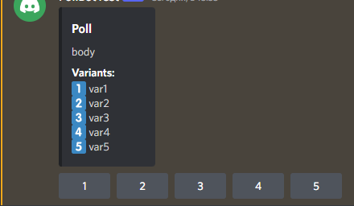

# Poll

Only users with the [Computor](https://github.com/Qubic-World/qubic-howto#roles-register) role can create and take part in the poll. You can vote as many times as your IDs are computors

The `/poll` command is used to create a poll. It can only be used in the [polls](https://discord.com/channels/768887649540243497/995048638508191897) channel. The command accepts as arguments: the poll text and the voting options\
Example:

```
/poll "body" "var1" "var2" "var3" "var4" "var5"
```



The maximum number of variants is 5\
By clicking on the voting button you give **all** your votes to this variant. The number of your votes is the number of IDs that are `computors`. The number of votes in unclosed polls may change when your IDs, which are computors, have increased or decreased. This can happen by changing epochs, you have registered or unregister IDs

Clicking on any of the survey options again will give you the information: Which variant did you choose How many of your IDs took the poll
